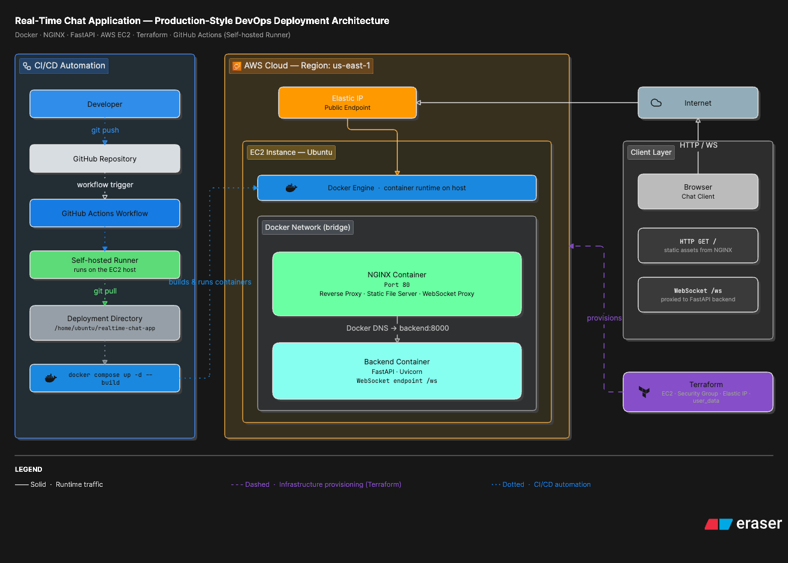
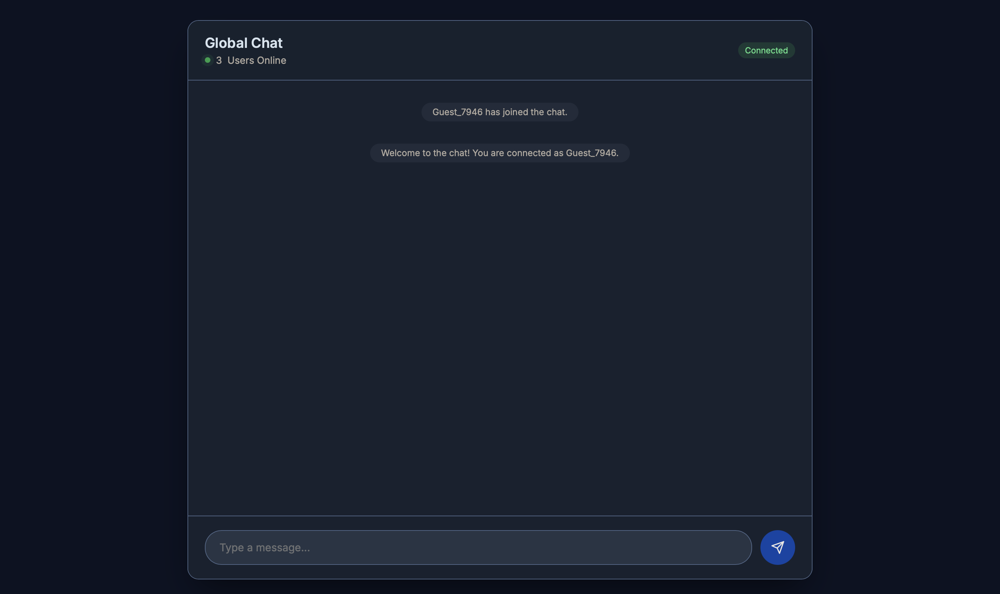
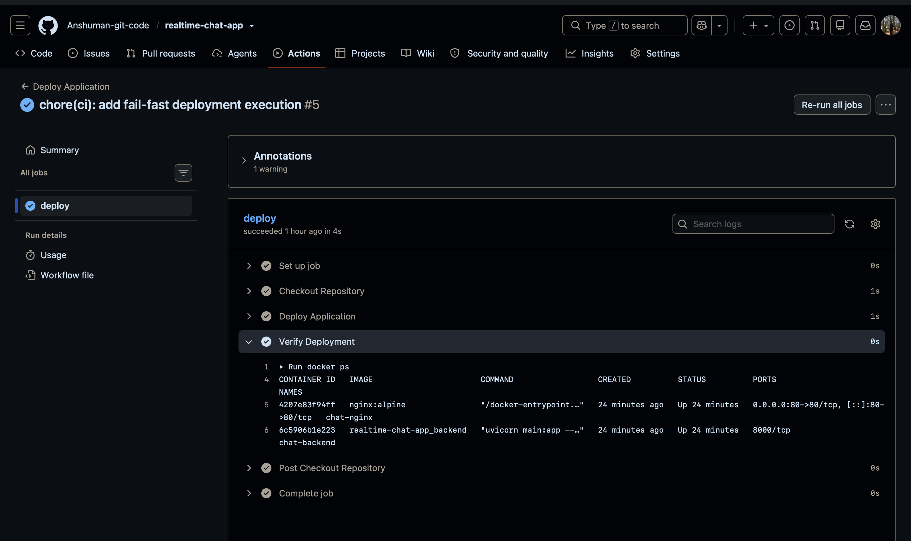

# Real-Time Chat Application — DevOps Engineering Assignment

## 1. Project Overview

This repository contains a production-style staging environment for a real-time chat application. The assignment presented a deliberately misconfigured codebase and required end-to-end resolution: debugging broken container networking, restoring the NGINX reverse proxy, and deploying the corrected stack to a cloud environment with fully automated CI/CD.

The work covers four engineering domains:

- Container debugging and local deployment via Docker Compose
- Cloud infrastructure provisioning via Terraform
- Automated deployment via GitHub Actions with a self-hosted runner
- Documentation of architectural decisions, incidents, and verification results

---

## 2. Assignment Objective

The repository was provided as a deliberately misconfigured staging environment. The backend application logic was intentionally left unchanged. The objective was to identify and repair all infrastructure and deployment failures, then extend the environment to the cloud with full automation.

Core responsibilities:

- Docker container debugging
- Docker Compose service orchestration
- Container networking and DNS resolution
- NGINX reverse proxy configuration
- WebSocket protocol proxying
- Cloud infrastructure provisioning via Infrastructure as Code
- CI/CD pipeline design and automation

---

## 3. Key Features

| Feature | Implementation |
| :--- | :--- |
| Containerized backend | Python FastAPI served by Uvicorn inside a Docker container |
| Multi-container orchestration | Docker Compose manages backend and NGINX as a coordinated stack |
| NGINX reverse proxy | Static frontend served at `/`, WebSocket traffic proxied at `/ws` |
| WebSocket support | Full-duplex real-time messaging via the `/ws` endpoint |
| Infrastructure as Code | Terraform provisions EC2, Security Group, Key Pair, and Elastic IP |
| Automated deployment | GitHub Actions triggers `docker-compose up -d --build` on every push to `main` |
| Self-hosted CI/CD runner | Runner installed on the target EC2 instance, eliminating SSH hop and external secrets |
| Elastic IP stability | Static public IP persists across infrastructure teardown and rebuild cycles |

---

## 4. Repository Structure

```
realtime-chat-app/
├── app/
│   ├── main.py              # FastAPI application — WebSocket handler and connection manager
│   └── requirements.txt     # Python runtime dependencies
├── frontend/
│   └── index.html           # Single-page chat client; connects via WebSocket
├── terraform/
│   └── main.tf              # Full AWS infrastructure definition (EC2, SG, EIP, Key Pair)
├── .github/
│   └── workflows/
│       └── deploy.yml       # GitHub Actions workflow — triggered on push to main
├── Dockerfile               # Builds the Python backend image
├── docker-compose.yml       # Composes backend and NGINX services
├── nginx.conf               # NGINX routing — static files and WebSocket proxy rules
├── BugFix.md                # Root cause analysis and resolution log for all three bugs
├── CloudDeployment.md       # ADR and verification log for Terraform cloud provisioning
└── GitHubActions.md         # Engineering journal covering all four CI/CD milestones
```

---

## 5. Architecture

A professional architecture diagram illustrating the full deployment pipeline is planned for this section.



---

## 6. Live Application

The following screenshots document successful deployment of the application stack. They are placeholders pending final documentation of the live environment.

### Browser



The browser successfully loads the frontend through NGINX while communicating with the backend using WebSockets.

### GitHub Actions



Successful GitHub Actions deployment executed on the self-hosted runner after pushing to the `main` branch.


---

## 7. Technology Stack

| Category | Technology |
| :--- | :--- |
| **Backend** | Python 3.11, FastAPI, Uvicorn, WebSockets |
| **Frontend** | HTML5, Vanilla JavaScript (WebSocket API) |
| **Containers** | Docker, Docker Compose |
| **Reverse Proxy** | NGINX (Alpine) |
| **Infrastructure** | Terraform, AWS EC2 (t3.micro), AWS Elastic IP, AWS Security Group |
| **CI/CD** | GitHub Actions, self-hosted runner |
| **Cloud** | AWS (us-east-1), Ubuntu 22.04 LTS (Canonical AMI) |

---

## 8. Quick Start

```bash
git clone https://github.com/<your-username>/realtime-chat-app.git
cd realtime-chat-app
docker-compose up -d --build
```

Open `http://localhost` in a browser once both containers are running.

For full deployment details and the automated cloud workflow, see [Deployment Workflow](#9-deployment-workflow) below.

---

## 9. Deployment Workflow

### Local

```bash
docker-compose up -d --build
# Application available at http://localhost
```

Both containers must be running (`chat-backend` and `chat-nginx`) before the WebSocket endpoint becomes reachable.

### Cloud (Automated)

Every push to the `main` branch triggers the GitHub Actions workflow defined in `.github/workflows/deploy.yml`. The self-hosted runner — installed directly on the EC2 instance — executes the following sequence:

1. Checkout the latest repository state
2. Navigate to the deployment directory on the host
3. Run `git pull` to synchronize source files
4. Run `docker-compose up -d --build` to rebuild and restart modified containers
5. Run `docker ps` to confirm both services entered the running state

Because the runner executes natively on the target host, no SSH credentials or external secrets are required in the deployment path.

Full pipeline design, ADR, and milestone verification are documented in [GitHubActions.md](./GitHubActions.md).

---

## 10. Documentation Index

| Document | Contents |
| :--- | :--- |
| [BugFix.md](./BugFix.md) | Root cause analysis for all three configuration bugs: Uvicorn host binding, missing NGINX volume mount, and WebSocket proxy header failures. Includes local verification test cases and results. |
| [CloudDeployment.md](./CloudDeployment.md) | ADR covering the decision to use Terraform over manual provisioning and AWS CloudFormation. Documents the `t2.micro` free-tier incident and its resolution, infrastructure smoke testing, and an immutable rebuild verification sequence. |
| [GitHubActions.md](./GitHubActions.md) | Four-milestone engineering journal covering runner provisioning, the pivot from GitHub-hosted to self-hosted runners, manual deployment validation, and the final automated deployment workflow. Includes architectural decision records and a failure-handling strategy. |

---

## 11. Verification Summary

The following table documents the verification activities performed during implementation to confirm that each component of the stack operates correctly end-to-end.

| Verification Target | Method | Result |
| :--- | :--- | :--- |
| Container networking | `docker ps`, multi-tab WebSocket session | Both containers running; messages broadcast in real time |
| NGINX static file serving | Browser access to `http://localhost` | Chat UI loads correctly |
| WebSocket proxy | Browser DevTools network panel, `/ws` connection state | Persistent connection established; no handshake failures |
| Container restart policy | `docker exec chat-nginx nginx -s stop` followed by `docker ps` | NGINX container restarted automatically via `restart: always` |
| Terraform provisioning | `terraform apply`, SSH to Elastic IP | EC2 accessible; Docker daemon running; no manual setup required |
| Elastic IP persistence | Infrastructure destroy and rebuild | Same public IP retained across full teardown-rebuild cycle |
| GitHub Actions deployment | Push to `main`, Actions log review | Workflow triggered; containers rebuilt and verified on EC2 |

---

## 12. Future Production Improvements

The current implementation is scoped to a staging environment. Moving toward production readiness would require:

- **HTTPS / TLS termination** — Add a certificate (Let's Encrypt or ACM) and configure NGINX to handle TLS. The frontend WebSocket client already supports `wss:` via protocol detection.
- **Load balancing** — Introduce an AWS Application Load Balancer with sticky sessions or connection-aware routing for WebSocket traffic across multiple backend instances.
- **Auto Scaling** — Define an Auto Scaling Group to handle variable connection load, particularly relevant for a stateful WebSocket workload.
- **Secrets management** — Move any credentials and keys into AWS Secrets Manager or SSM Parameter Store rather than relying on key files referenced from local disk paths.
- **Observability** — Add structured logging (e.g., CloudWatch Logs), metrics collection, and alerting to monitor active connection counts and container health.
- **Remote Terraform state** — Migrate `terraform.tfstate` to an S3 backend with DynamoDB locking to support collaborative infrastructure management and prevent state corruption.
- **Security group hardening** — Port 22 is currently open for administrative access and assignment evaluation purposes. This project uses a self-hosted GitHub Actions runner installed directly on the EC2 instance, so outbound SSH from a runner is not required in the deployment path. In a production environment, SSH ingress should be restricted to trusted IP ranges or replaced with a more secure administrative access mechanism such as AWS Systems Manager Session Manager.

---

## 13. Conclusion

This project demonstrates practical DevOps engineering across the full deployment lifecycle: diagnosing and resolving container networking and proxy configuration failures, provisioning reproducible cloud infrastructure with Terraform, and delivering a fully automated deployment pipeline with GitHub Actions. The result is a working staging environment where a single push to `main` rebuilds and redeploys the application stack without manual intervention.

The repository reflects a production-style staging deployment that balances assignment constraints with engineering best practices: deliberate architectural decisions are documented as ADRs, known trade-offs are acknowledged explicitly, and the verification record provides an auditable trail from local debugging through to cloud deployment.
